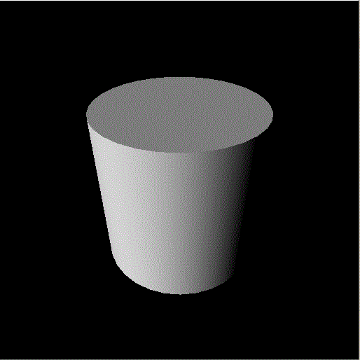
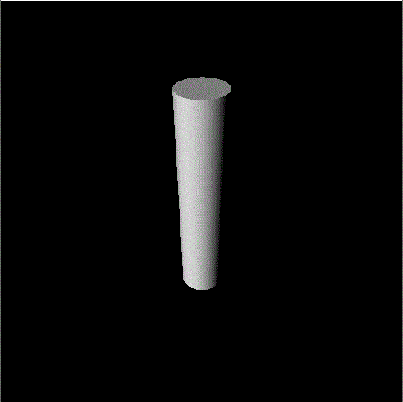

# More geometries

In [Hello Cube](hello_cube.md), you've successfully loaded a cube and display it.

We may also have a variety of geometries rathern than just cubes. Let's have a try!


## Recall our cube

Recall that we use `t3.Geometry.cube` -> `t3.Mesh.from_obj` -> `t3.Model` for creating a cube:

```py
obj = t3.Geometry.cube()                 # create a cube geometry object
model = t3.Model(t3.Mesh.from_obj(obj))  # create a mesh model from a geometry object
scene.add_model(model)
```

## Hello cylinder

To create a cylinder, just:

```py
obj = t3.Geometry.cylinder()
model = t3.Model(t3.Mesh.from_obj(obj))
scene.add_model(model)
```




## Tweaking the cylinder

You could also specify some arguments to the `cylinder`, for example:

```py
obj = t3.Geometry.cylinder(semiheight=1, radius=0.2)
```

will result in a cylinder with 2 in height, 0.2 in radius:

